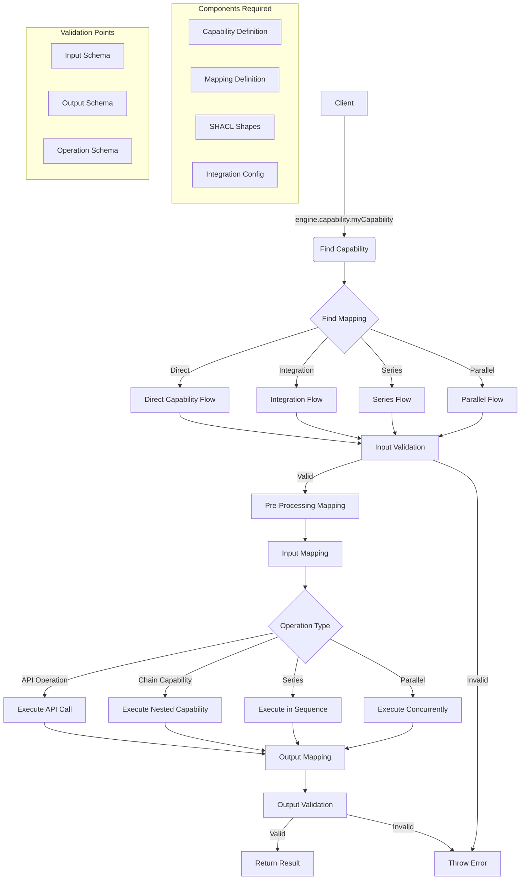

# Capability System Flow

## Overview

The capability system provides a declarative way to define and execute operations with validation, data mapping, and transformation. Each capability represents a discrete operation that can be executed.

## System Flow Diagram



## Core Entities

### Capability
```typescript
type Capability = NodeObject & {
  '@id': string;
  '@type': typeof SKL.Capability;
  [SKL_V2.label]?: ValueObject<string>;
  [SKL.inputsContext]?: ValueObject<JSONObject>;
  [SKL.inputs]?: NodeShape | ReferenceNodeObject;
  [SKL.outputsContext]?: ValueObject<JSONObject>;
  [SKL.outputs]?: NodeShape | ReferenceNodeObject;
}
```

### Mapping
```typescript
type Mapping = NodeObject & {
  // Pre-processing 
  [SKL.preProcessingMapping]?: OrArray<TriplesMap>;
  [SKL.preProcessingMappingFrame]?: ValueObject<JSONObject>;
  
  // Input handling
  [SKL.inputsMapping]?: OrArray<TriplesMap>;
  [SKL.inputsMappingFrame]?: ValueObject<JSONObject>;
  [SKL.inputsReference]?: string;
  
  // Operation definition
  [SKL.operationId]?: ValueObject<string>;
  [SKL.operationMapping]?: TriplesMap;
  
  // Capability linking
  [SKL.capabilityId]?: ValueObject<string>;
  [SKL.capabilityMapping]?: TriplesMap;
  
  // Output handling
  [SKL.outputsMapping]?: OrArray<TriplesMap>;
  [SKL.outputsMappingFrame]?: ValueObject<JSONObject>;
  [SKL.outputsReference]?: string;
  
  // Flow control
  [SKL.series]?: { '@list': CapabilityMapping[] };
  [SKL.parallel]?: OrArray<CapabilityMapping>;
}
```

## Flow Steps

1. **Capability Invocation**
   ```typescript
   // Called by user
   engine.capability.myCapability(args, config)
   ```

2. **Capability Resolution**
   ```typescript
   // Internal flow
   - Find capability by name
   - Find appropriate mapping for capability
   - Validate inputs against capability schema
   ```

3. **Mapping Execution Pipeline**
   ```typescript
   // Steps in executeMapping()
   a. Pre-processing mapping (if defined)
   b. Input mapping/reference resolution
   c. Operation execution:
      - Direct capability
      - API operation
      - Series execution
      - Parallel execution
   d. Output mapping/frame application
   ```

4. **Result Validation & Return**
   ```typescript
   - Validate output against capability schema
   - Return mapped result
   ```

## Key Execution Patterns

### Direct Capability
```typescript
const capabilityId = await this.performCapabilityMappingWithArgs(args, mapping);
return await this.executeCapability(mappedCapability, capabilityArgs);
```

### Series Execution
```typescript
// Execute capabilities in sequence
executeSeriesFromList(
    list: Mapping[],
    args: SeriesCapabilityArgs
): Promise<OrArray<NodeObject>>
```

### Parallel Execution
```typescript
// Execute capabilities concurrently
executeParallelMapping(
    mapping: MappingWithParallel,
    args: JSONObject
): Promise<NodeObject[]>
```

## Important Methods

### SKLEngine
- `executeCapability()`: Core capability execution
- `executeMapping()`: Processes mapping definitions
- `performMapping()`: Handles RML transformations
- `findMappingForCapabilityContextually()`: Resolves appropriate mapping

### Mapper
- `apply()`: Executes RML mapping
- `doMapping()`: Processes mapping rules
- `frame()`: Applies JSON-LD framing

## Expected from Caller

1. **Configuration**
   ```typescript
   const engine = new SKLEngine({
     type: 'memory',
     functions: customFunctions,
     callbacks: eventHandlers,
     disableValidation: false
   });
   ```

2. **Capability Invocation**
   ```typescript
   const result = await engine.capability.myCapability({
     input1: "value",
     input2: 123
   }, {
     callbacks: {
       onCapabilityStart: (id, args) => {},
       onCapabilityEnd: (id, result) => {}
     }
   });
   ```

3. **Required Entities in Store**
   - Capability definitions
   - Mapping definitions
   - Input/Output schemas (SHACL shapes)

## Common Flow Patterns

1. **Simple Operation**
   ```
   Input -> Validation -> Mapping -> Operation -> Result
   ```

2. **Composite Operation**
   ```
   Input -> Validation -> Series/Parallel Execution -> Result
   ```

3. **Integration Operation**
   ```
   Input -> Validation -> API Operation -> Mapping -> Result
   ```

## Error Handling

- Input validation errors (SHACL)
- Output validation errors (SHACL)
- Operation execution errors
- Mapping transformation errors

Each error type includes detailed validation reports or error messages to help diagnose issues.